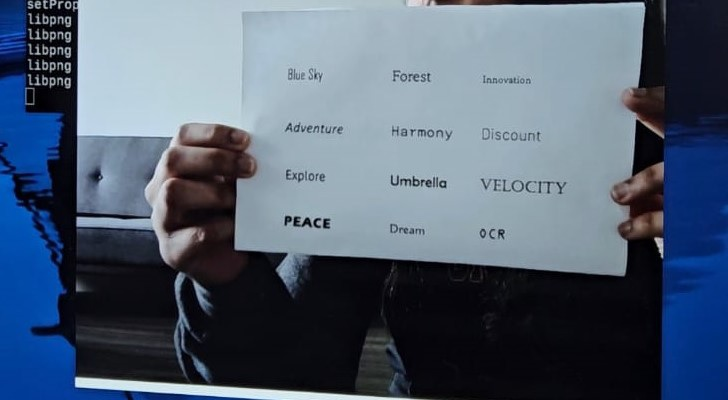

# Text-to-Speech (TTS) System for OCR-Generated Text

- [Introduction](#introduction)
- [Hardware Evolution](#hardware-evolution)
- [Iterative Model Development](#iterative-model-development)
- [Results](#results)

## Introduction
- Reading challenges are common, especially for the visually impaired. Converting text to audio seamlessly is crucial to making information more accessible and inclusive.
- Text-to-Speech (TTS) System for OCR-Generated Text transforms printed or digital text into audio, addressing the need for quick and easy access to information.

## Hardware Evolution
- Initial Hardware Choice: Arduino Nano 33 BLEwith OV7675 camera module.
- Issue: Insufficient image resolution for ML model training.
- Midway Transition: Shifted to ESP32 CAM with OV2640 camera module.
- Challenge: RAM limitations hindered model deployment on ESP32.
- Optimal Solution: Finalized Raspberry Pi 4 for robust performance.
- Features: Raspberry Pi 4 offers ample RAM, processing power, and GPIO support, essential for efficient OCR implementation.

## Iterative Model Development
- Algorithm Training:Utilized synthetic data for initial training iterations.
- Challenges Encountered:Overcame dataset annotation issues and model performance drawbacks through iterative training.
- Optimization Strategies:Fine-tuned the model to achieve real-time OCR on Raspberry Pi 4.

## Results
- Performance Metrics: Achieved OCR accuracy rate of 74% with 'mjsynth' dataset on Raspberry Pi 4.
- Real-time Demonstration:Live showcase of text-to-audio conversion on Raspberry Pi 4, reinforcing practicality.

- **Fig 1:** Real time implementation of the model
---

## References
- https://paperswithcode.com/dataset/textocr
- @articleshi2017end, An End-to-End Trainable Neural Network for Image-based Sequence Recognition and Its Application to Scene TextRecognition, author=Shi, Baoguang and Bai, Xinggang and Yao, Cong, journal=IEEE Transactions on Pattern Analysis and Machine Intelligence
(TPAMI), year=2017
- @articlewang2011end, title=End-to-End Text Recognition with Convolutional Neural Networks, author=Wang, Kai and Babenko, Boris and Belongie, Serge, journal=Proceedings of the International Conference on Document Analysis and Recognition (ICDAR), year=2011
- @miscJaderberg2014SyntheticDT, title=Synthetic Data for Text Localisation, Recognition and Tracking, author=Max Jaderberg and Karen Simonyan
and Andrea Vedaldi and Andrew Zisserman, year=2014, eprint=1406.2227, archivePrefix=arXiv, primaryClass=cs.CV
- @misctext-recognition-github, title = Text Recognition using Deep Learning, howpublished = https://github.com/rjnp2/Text-Recognition-using-Deep-Learning, note = Accessed: December 5, 2023